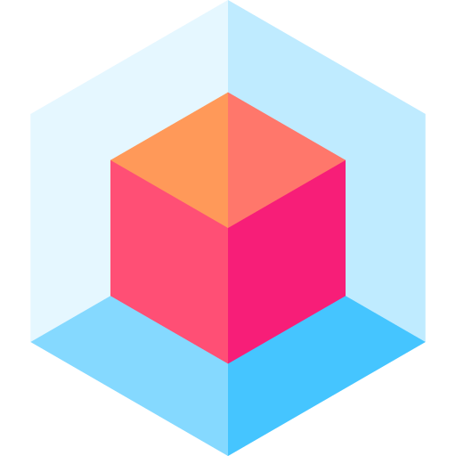

# Cubby



[](https://github.com/utilForever/Cubby/blob/main/LICENSE)     [](https://travis-ci.com/utilForever/Cubby)

[](https://codecov.io/gh/utilForever/Cubby)
[](https://www.codacy.com/gh/utilForever/Cubby/dashboard?utm_source=github.com&amp;utm_medium=referral&amp;utm_content=utilForever/Cubby&amp;utm_campaign=Badge_Grade)
[](https://lgtm.com/projects/g/utilForever/Cubby/alerts/)
[](https://lgtm.com/projects/g/utilForever/Cubby/context:cpp)
[](https://www.codefactor.io/repository/github/utilforever/Cubby)

[](https://sonarcloud.io/dashboard?id=Cubby) [](https://sonarcloud.io/dashboard?id=Cubby) [](https://sonarcloud.io/dashboard?id=Cubby) [](https://sonarcloud.io/dashboard?id=Cubby) [](https://sonarcloud.io/dashboard?id=Cubby)

Cubby is a voxel-based MMORPG client using C++ with Entity Component System (ECS). The code is built on C++17 and can be compiled with commonly available compilers such as g++, clang++, or Microsoft Visual Studio. Cubby currently supports macOS (10.14 or later), Ubuntu (18.04 or later), Windows (Visual Studio 2017 or later), and Windows Subsystem for Linux (WSL). Other untested platforms that support C++17 also should be able to build Cubby.

## Key Features

* 3D voxel game client with cuboid and box-based rendering aesthetic.
* GLSL shader support.
* Support for deferred or forward rendering.
* Fully dynamic and unlimited lighting system using deferred lighting model.
* Advanced graphics shaders included - SSAO, shadow mapping, dynamic lighting, FXAA.
* Full 3D math and geometry library (vector, matrix, quaternion, plane, bezier).
* Extensive camera functionality, either 3rd person or 1st person.
* In-built GUI that can be easily hooked up to gameplay functioanlity (re-skinable).
* Qubicle Binary (.qb) voxel model loading.
* Polygon model loading via ms3d and obj files.
* Keyframe and skeleton animation support.
* Basic 'player' functionality - movement, controls, animation.
* 'Voxel character' encapsulating character behaviours - idle looking, breathing, etc.
* Facial animation support for voxel characters.
* Voxel scenery and world items.
* Block/cube particle effect system.
* Modding and scripting support via LUA.
* Gamepad and controller support.
* Voxel world and terrain generation.
* Procedural content creation.
* Audio and music playback.

## Gameplay Features

Some parts of the Cubby gameplay logic are also incorporated into this source code repo, to better facilitate code sharing and the different sub-systems that make up the game. Some of the gameplay features of Cubby are as follows:

* Player movement and controls.
* Inventory and item management.
* NPC AI and player interations.
* Quets and gameplay objectives.
* Enemies and monsters.
* Combat using melee and ranged weapons, magic and spellcasting.
* Farming and crop management.
* Character creation and player generation.
* World customization and creation elements.

## Quick Start

You will need CMake to build the code. If you're using Windows, you need Visual Studio 2017 in addition to CMake.

First, clone the code:

```
git clone https://github.com/utilForever/Cubby.git --recursive
cd Cubby
```

### C++ API

For macOS or Linux or Windows Subsystem for Linux (WSL):

```
mkdir build
cd build
cmake ..
make
```

For Windows:

```
mkdir build
cd build
cmake .. -G"Visual Studio 15 2017 Win64"
MSBuild Cubby.sln /p:Configuration=Release
```

### Docker

```
docker pull utilforever/cubby:latest
```

## Documentation

TBA

## How To Contribute

Contributions are always welcome, either reporting issues/bugs or forking the repository and then issuing pull requests when you have completed some additional coding that you feel will be beneficial to the main project. If you are interested in contributing in a more dedicated capacity, then please contact me.

## Contact

You can contact me via e-mail (utilForever at gmail.com). I am always happy to answer questions or help with any issues you might have, and please be sure to share any additional work or your creations with me, I love seeing what other people are making.

## License


The class is licensed under the [GNU General Public License v3.0 License](http://opensource.org/licenses/MIT):

Copyright &copy; 2021 Cubby Team

  * [Chris Ohk](https://github.com/utilForever)
  * [Seungoh Han](https://github.com/h5jam)
  * [Jaeyong Sung](https://github.com/buttercrab)
  * [Seungbin Oh](https://github.com/sboh1214)

Cubby is free software: you can redistribute it and/or modify it under the terms of the GNU General Public License as published by the Free Software Foundation, either version 3 of the License, or (at your option) any later version. Cubby is distributed in the hope that it will be useful, but WITHOUT ANY WARRANTY; without even the implied warranty of MERCHANTABILITY or FITNESS FOR A PARTICULAR PURPOSE.  See the GNU General Public License for more details.